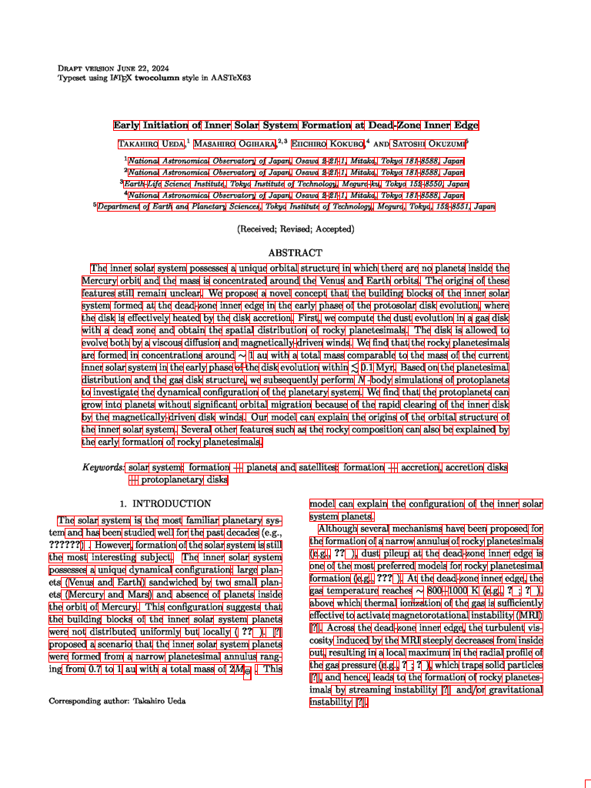
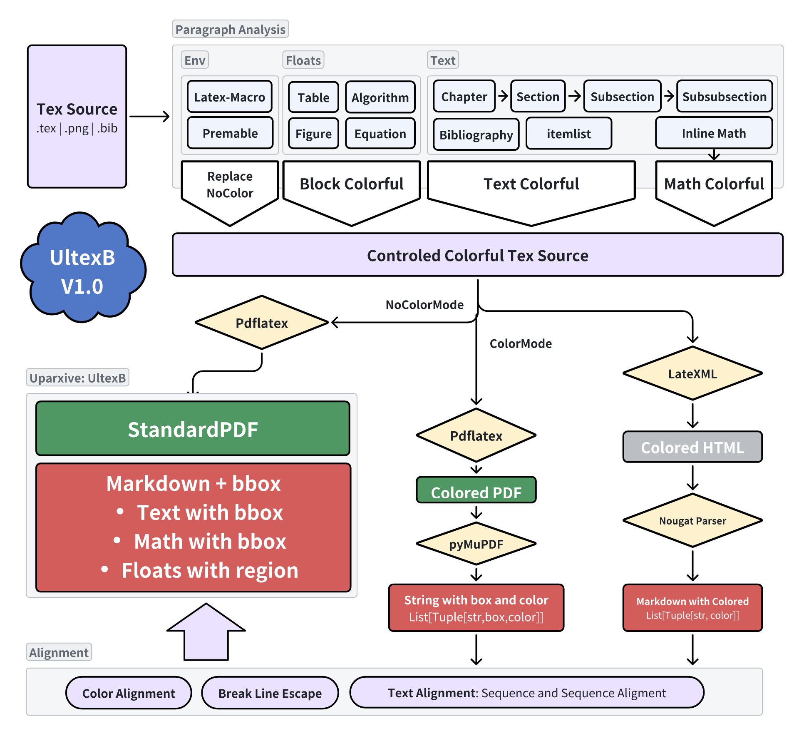
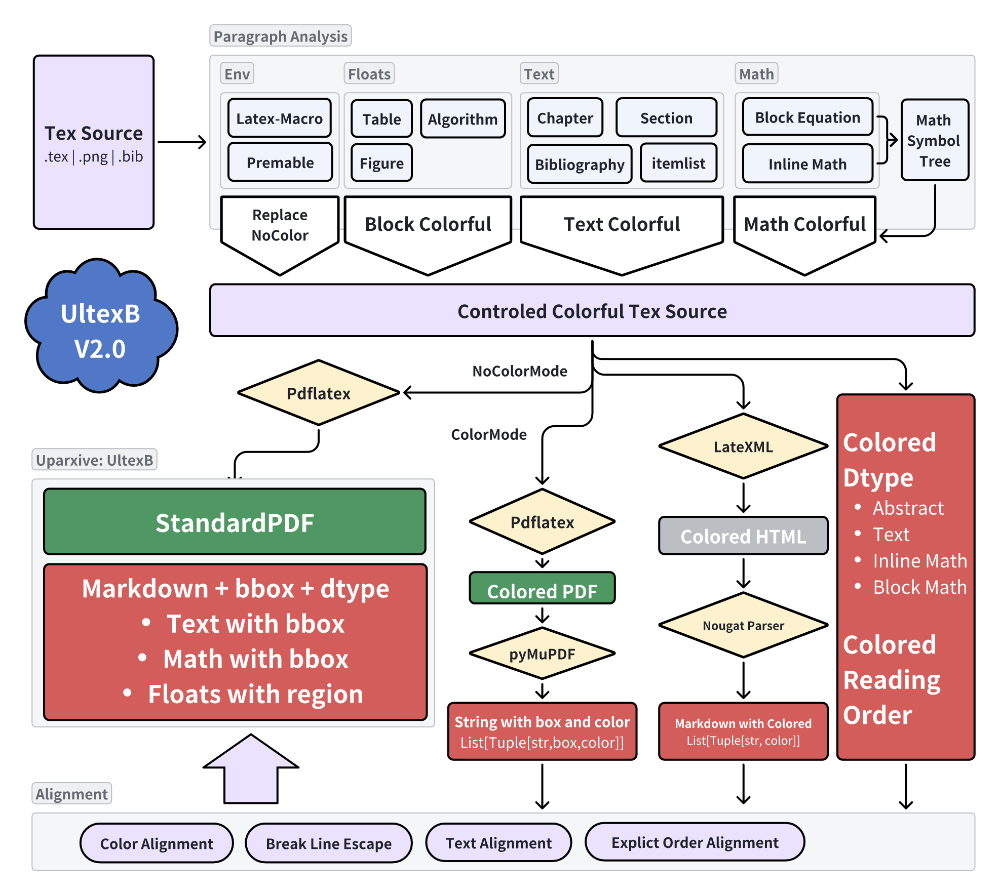

# The uparxive level-text-with-boxed dataset

> Lets call it `UltexB` dataset.

This data aim to provide a text level aligment between `markdown` format and its `pdf` format as show below:

The markdonw part

```markdown
# Early Initiation of Inner Solar System Formation at Dead - Zone InnerEdge
 TakahiroUeda
 National Astronomical Observatory of Japan , Osawa 2 - 21 - 1, Mitaka , Tokyo 181 - 8588,Japan
 MasahiroOgihara
 National Astronomical Observatory of Japan , Osawa 2 - 21 - 1, Mitaka , Tokyo 181 - 8588,Japan
 Earth - Life Science Institute , Tokyo Institute of Technology , Meguro - ku , Tokyo 152 - 8550,Japan
 EiichiroKokubo
 National Astronomical Observatory of Japan , Osawa 2 - 21 - 1, Mitaka , Tokyo 181 - 8588,Japan
 SatoshiOkuzumi
 Department of Earth and Planetary Sciences , Tokyo Institute of Technology , Meguro , Tokyo , 152 - 8551,Japan
###### The inner solar system possesses a unique orbital structure in which there are no planets inside the Mercury orbit and the mass is concentrated around the Venus and Earth orbits . The origins of these features still remain unclear . We propose a novel concept that the building blocks of the inner solar system formed at the dead - zone inner edge in the early phase of the protosolar disk evolution , where the disk is effectively heated by the disk accretion . First , we compute the dust evolution in a gas disk with a dead zone and obtain the spatial distribution of rocky planetesimals . The disk is allowed to evolve both by a viscous diffusion and magnetically - driven winds . We find that the rocky planetesimals are formed in concentrations around $ \sim $  1 au with a total mass comparable to the mass of the current inner solar system in the early phase of the disk evolution within $ \lesssim 0.1 $  Myr . Based on the planetesimal distribution and the gas disk structure , we subsequently perform N - body simulations of protoplanets to investigate the dynamical configuration of the planetary system . We find that the protoplanets can grow into planets without significant orbital migration because of the rapid clearing of the inner disk by the magnetically - driven disk winds . Our model can explain the origins of the orbital structure of the inner solar system . Several other features such as the rocky composition can also be explained by the early formation of rocky planetesimals.
 solar system : formation - - - planets and satellites : formation - - - accretion , accretion disks - - - protoplanetarydisks

## The solar system is the most familiar planetary system and has been studied well for the past decades ) . However , formation of the solar system is still the most interesting subject . The inner solar system possesses a unique dynamical configuration : large planets ( Venus and Earth ) sandwiched by two small planets ( Mercury and Mars ) and absence of planets inside the orbit of Mercury . This configuration suggests that the building blocks of the inner solar system planets were not distributed uniformly but locally ( ) . [ ? ] proposed a scenario that the inner solar system planets were formed from a narrow planetesimal annulus ranging from $ 0.7 $  to $ 1~{}{\rm au}$  with a total mass of $ 2 M_{\oplus}$  . This model can explain the configuration of the inner solar system planets. Although several mechanisms have been proposed for the formation of a narrow annulus of rocky planetesimals ( e .g . , ) , dust pileup at the dead - zone inner edge is one of the most preferred models for rocky planetesimal formation ( e .g . , ) . At the dead - zone inner edge , the gas temperature reaches $ \sim $  800 - - 1000 K ( e .g . , ; ) , above which thermal ionization of the gas is sufficiently effective to activate magnetorotational instability ( MRI ) [ ? ] . Across the dead - zone inner edge , the turbulent viscosity induced by the MRI steeply decreases from inside out , resulting in a local maximum in the radial profile of the gas pressure ( e .g . , ; ) , which traps solid particles [ ? ] , and hence , leads to the formation of rocky planetesimals by streaming instability [ ? ] and / or gravitational instability [ ? ].

```

The PDF format



---

## Resource available

- Version 1.0: Huggingface

## Introduction



The UltexB dataset follow the core idea in [LOCR](https://arxiv.org/abs/2403.02127 "LOCR: Location-Guided Transformer for Optical Character Recognition") which will modify the tet source to its colorful version. More detaily, 

- it will add color command for each visable char include text, math symbol and so on
- floats element that any object that you can assign `[h]` in latex like `figure` `math` `table` and so on will be boxed totolly.
  - > this means that we will not colorful the content text in table or block math which is quite different from original LOCR.
    >
- color is iter from [0,0,0] to [255,255,255], typically it is enough for cover whole char in one page.
  - > it still possible exhausts the color range for a very long paper.
    >
- Aligment include color aligment (original idea) and a simple sequence and sequence aligment in case duplicated, missing and cross-page color
- Math color engine is rewrited with a previour parser build through [latex2mathml ](https://github.com/osanshouo/latex2mathml)and [TexSoup](https://github.com/alvinwan/TexSoup)

> Most choice is for higher passing rate for pdf compiling. For example, add color to math formula is quite risk, it is easy break the tex compile. This is also the reason we remove the block equation colorful schedule.

## Known ShortComing

Currently, there are some shortcoming for version 1.0 dataset. For example,

- In `pdf` side, most shortcoming comes from pdflatex compiler
  - The reference always rendered as `?`
  - System Char like `Keywords` , `Abstract`, `footnote` and so on is not colored. (which may influence the qulity for parsing paragraph information)
  - Content for Paper or Thesis may get wrong detect.
- In `markdown` side,
  - sometimes there are un-deleted color latex remain.
  - sometimes will appear text missing.
  - Many addition char like system char in markdown is invisable, their  bbox and color may become trouble in some case.

## Future Plan

### Version 2.0

- Latex Math can be view as symbol tree format as shown in [latex2mathml ](https://github.com/osanshouo/latex2mathml)and [TexSoup](https://github.com/alvinwan/TexSoup). Thus, it is possible to design a much better
- Originally, we align `PDF:bbox-color-dict_text` and `markdown:color-ordered_text` directly via the order in color order in markdown. Usually, each color only appear once during processing. However, it will fail when a `content` is created who collect whole the paragraph name to the start of a paper. Thus, in version 2, I think we should directly create a `color-dtype` pool through the colorful processing to assit aligment.


